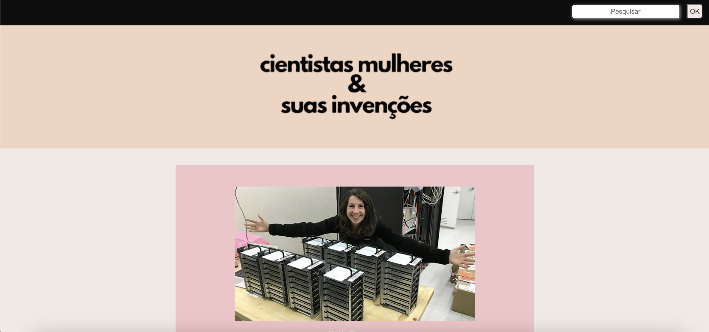

# **Projeto Website - Cientistas Mulheres**

O Projeto é um site com informações de cientistas mulheres famosas e suas contribuições para a ciência moderna. O projeto possui uma página principal com uma barra de pesquisa e foi desenvolvido como parte do bootcamp Labenu.

## **Índice**
- <a href="#funcionalidades-do-projeto">Funcionalidades do projeto</a>
- <a href="#layout">Layout</a>
- <a href="#demonstração">Demonstração</a>
- <a href="#como-rodar-esse-projeto">Como rodar esse projeto?</a>
- <a href="#tecnologias-utilizadas">Tecnologias utilizadas</a>
- <a href="#pessoas-autoras">Pessoas autoras</a>

## **Funcionalidades do projeto**
- [x] Lista com informações das cientistas
- [x] Barra de pesquisa para encontrar palavras-chaves

## **Layout**


## **Demonstração**
[Link demonstração](https://constance03.github.io/projeto-cientistas/)

## **Como rodar esse projeto?**

```
# Clone esse repositório
$ git clone link-repositorio

# Acesse a pasta do projeto no seu terminal
$ cd projeto-cientistas

# Abrir o live server no index.html

```

## **Tecnologias utilizadas**

1. HTML
2. CSS
3. JavaScript


## **Pessoas autoras**


[Linkedin](https://www.linkedin.com/in/mariaconstance/)

